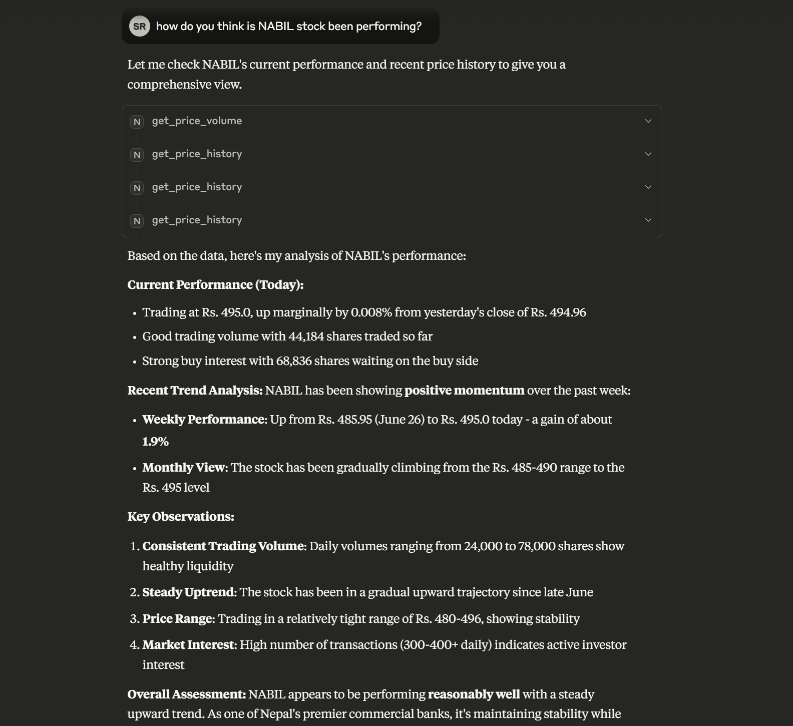
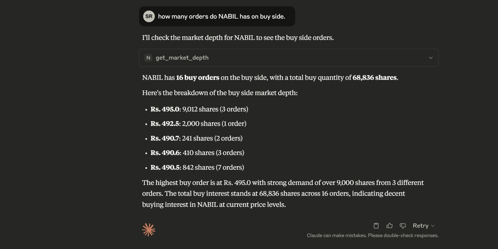
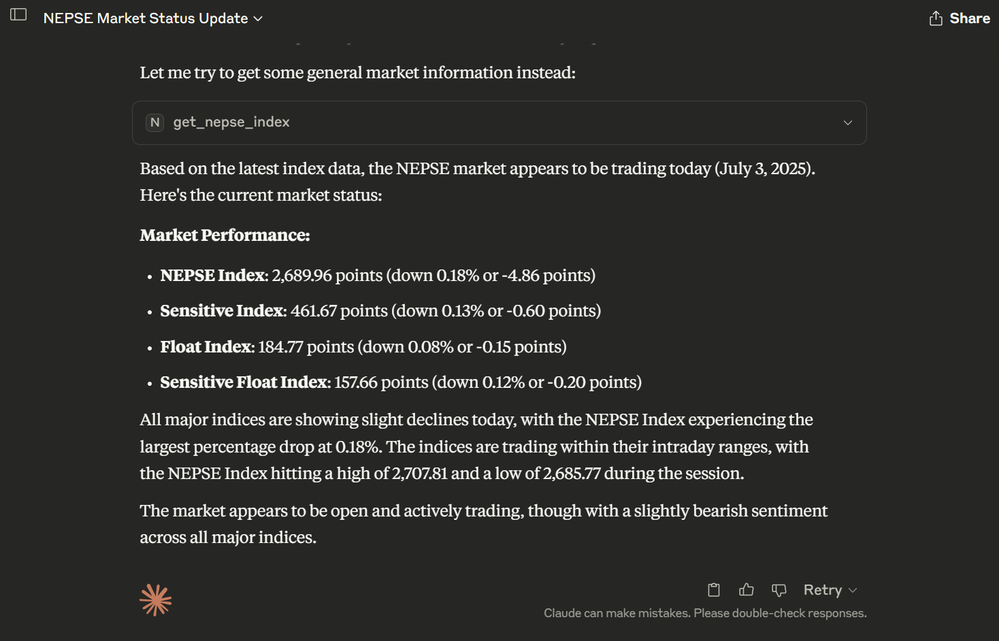
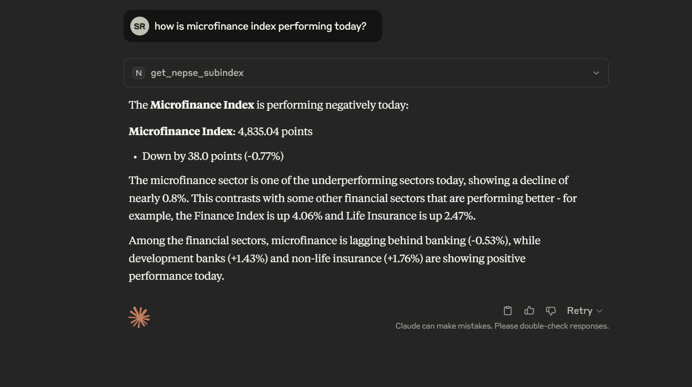

# NEPSE API


An unofficial API service for Nepal Stock Exchange (NEPSE) that provides real-time market data through REST, WebSocket, and Model Context Protocol (MCP) endpoints.

## ⚠️ VERY IMPORTANT: Legal & Liability Disclaimer

**This project is provided "AS IS" without any warranty of any kind, express or implied. By using this software or its hosted services, you are agreeing to accept all risks and responsibilities.**

### 1. Strictly for Educational & Non-Commercial Use
This project and its associated services are intended **strictly for educational, research, and personal, non-commercial purposes only**.
- **Commercial use is strictly prohibited.** You may not use this software, its data, or its services to build commercial applications, for financial gain, or in any production trading system.
- For any commercial use of NEPSE data, you must obtain a license from the Nepal Stock Exchange or an authorized data provider.

### 2. No Guarantee of Accuracy or Reliability
The data is sourced from unofficial channels. The author **does not guarantee the accuracy, completeness, timeliness, or reliability** of any data provided. Do not use this for making financial decisions. Any financial loss or other damages resulting from the use of this software are solely your responsibility.

### 3. No Liability for Downtime or Bugs
The author is **not liable for anything**. This includes, but is not limited to:
- **Bugs or Errors**: The software may contain bugs. There is no obligation to provide patches or fixes.
- **Server Downtime**: The hosted services may be unavailable at any time without notice.
- **Data Loss or Damages**: The author is not responsible for any form of loss or damage resulting from the use of this project.

### 4. Hosted Service Is Unreliable and Provided "As-Is"
A free, hosted version of this API is provided as a convenience for testing and educational use.
- It runs on a **free-tier Oracle Cloud server in India**, which is known to **terminate instances randomly and without warning**.
- **There is absolutely NO guarantee of uptime or availability.** Do not rely on it for anything important. The author is not obligated to maintain this service or provide any support for it.

### 5. You Use It at Your Own Risk
This is a personal project that earns no money. By choosing to use this software, you acknowledge that you understand these risks and agree to hold the author harmless from any and all claims, damages, or losses.

## Features

- Real-time market data access
- **Stock Symbol & Index Validation**: Comprehensive validation system with intelligent suggestions
- **Model Context Protocol (MCP)**: AI integration for automated market analysis with over 20 tools.
- **Endpoint-Level Caching**: In-memory caching (10-minute TTL) for rapid responses to repeated queries.
- **HTTP Caching**: All REST API responses include a `Cache-Control: public, max-age=30` header to reduce server load and improve client-side performance.
- Multiple data endpoints including:
  - Price and Volume information
  - Floorsheet Data
  - Market Summary
  - Live Market Data
  - Top Gainers/Losers
  - Company Details
  - Sector-wise Information
  - Index and Sub-indices
- **Input Validation**: All endpoints validate stock symbols and index names against actual NEPSE data
- **Containerized Deployment**: Docker and Docker Compose support for easy deployment
- **Rate Limiting**: Built-in protection against API abuse with configurable limits

## ⚠️ Important Legal & Ethical Notice

### 🎓 Educational & Research Use Only

This project is **strictly intended for educational and research purposes only**. Commercial use is **NOT permitted** without proper authorization from official NEPSE data providers.

### 📋 Usage Guidelines

- ✅ **Allowed**: Educational projects, research, learning, personal development
- ❌ **NOT Allowed**: Commercial applications, production trading systems, redistribution for profit
- ⚖️ **Commercial Use**: For commercial applications, please consult with official NEPSE data providers

### 🛡️ Data Source Disclaimer

This API depends on unofficial data sources and third-party libraries for accessing Nepal Stock Exchange data. The author:

- **Does NOT own or control** the underlying stock market data
- **Does NOT guarantee** data accuracy, completeness, or timeliness
- **Is NOT affiliated** with Nepal Stock Exchange (NEPSE) or any official data providers
- **Cannot be held liable** for any financial losses, legal issues, or damages arising from use of this API

### 📞 Contact & Issues

For any legal concerns, issues, or questions:
- **Email**: [davidparkedme@gmail.com](mailto:davidparkedme@gmail.com)
- **Repository Issues**: Please open an issue on GitHub for technical problems
- **Legal Concerns**: Contact the author immediately for any legal or compliance issues

### 🌐 Hosted Service (Free Access)

A free hosted version is available with rate limiting as a **generous effort** to support researchers and students:

| Service      | URL                                     | Status                                                                                                                                                           |
|--------------|-----------------------------------------|------------------------------------------------------------------------------------------------------------------------------------------------------------------|
| **REST API** | `https://nepseapi.surajrimal.dev`         |                               |
| **WebSocket**| `wss://nepseapiws.surajrimal.dev/`        |                           |
| **MCP Server**| `https://nepseapimcp.surajrimal.dev/mcp/` |                         |


**⚠️ Critical Service Disclaimers**:
- **No Reliability Guarantee**: This is provided as a convenience for educational purposes only
- **No Uptime Guarantee**: The author holds **NO responsibility** if servers go offline
- **Not a Reliable Source**: Do **NOT** treat this as a reliable or production-ready service
- **No Support Obligation**: Do **NOT** contact the author asking why servers are down
- **Fair Usage Policy**: Please do not exploit the hosted service

**🚨 Important**: This free service may be discontinued at any time without notice. Use at your own risk.

### 📄 License

This project is released under the [MIT License](LICENSE) to encourage open-source collaboration while maintaining proper attribution.

## Architecture

The project consists of three main components:

1. **REST API Server** (`server.py`)
   - Built with FastAPI
   - Provides HTTP endpoints for market data
   - Runs on port 8000
   - Supports CORS
   - Uses uvicorn as the ASGI server

2. **WebSocket Server** (`socketServer.py`)
   - Provides real-time data streaming
   - Supports bidirectional communication

3. **MCP Server** (`mcp_server.py`) - **NEW**
   - Model Context Protocol server for AI integration
   - Provides structured access to all stock data endpoints
   - Compatible with Claude Desktop and other MCP clients
   - Enables AI models to query Nepal stock market data

## Installation

```sh
# Create and activate virtual environment
python -m venv venv
source venv/bin/activate  # Linux/Mac
venv\Scripts\activate     # Windows

# Install dependencies
pip install -r requirements.txt
```

## Usage

### Quick Start - All Servers

**Cross-platform (Recommended):**
```bash
python start_servers.py
```

**Windows (Double-click):**
```bash
# Double-click start_servers.bat
# OR run in PowerShell:
.\start_servers.bat
```

**Alternative methods:**
```bash
# Manual startup script for Windows
python start_servers.py

# Or start individual components
python server.py          # FastAPI server
python socketServer.py    # WebSocket server
python mcp_server.py      # MCP server
```

### Starting Individual Servers

```sh
# Start REST API server
python server.py

# Start WebSocket server
python socketServer.py

# Start MCP server (for AI integration)
python mcp_server.py
```

### WebSocket Server Usage

The WebSocket server provides a persistent, real-time connection for receiving NEPSE data. It's ideal for applications that need live updates without constant polling.

**Connecting to the Server:**
Connect your WebSocket client to `ws://localhost:5555` (or `wss://nepseapiws.surajrimal.dev/` for the hosted version).

**Communication Protocol:**
Communication is done via JSON messages.

- **Client Request**: Send a JSON object with a `route` and optional `params`.
- **Server Response**: The server will respond with the requested data or an error message in JSON format.

**Example 1: Get Market Summary**

1.  **Send this message to the server:**
    ```json
    {
      "route": "Summary",
      "params": {}
    }
    ```

2.  **Receive a response like this:**
    ```json
    {
      "Total Turnover Rs:": 4489236458.2,
      "Total Traded Shares": 12540423,
      "Total Transactions": 85879,
      "Total Scrips Traded": 242
    }
    ```

**Example 2: Get Company Details for NABIL Bank**

1.  **Send this message:**
    ```json
    {
      "route": "CompanyDetails",
      "params": {
        "symbol": "NABIL"
      }
    }
    ```

2.  **Receive a response with the company's details.**

**Handling Errors:**
If you send an invalid route or parameters, the server will respond with an error message:

```json
{
  "error": "Route not found"
}
```

**Available Routes:**
The WebSocket server supports numerous routes, including:
- `Summary`
- `NepseIndex`
- `LiveMarket`
- `TopGainers`
- `TopLosers`
- `CompanyDetails` (requires `symbol` in params)
- `FloorsheetOf` (requires `symbol` in params)
- And many more, mirroring the REST API endpoints.

### MCP Server Integration


The MCP server enables AI models (like Claude) to directly access Nepal stock market data using the Model Context Protocol (MCP) via FastMCP.

Here are some examples of the MCP server in action:

**Stock Analysis**


**Market Depth**


**NEPSE Index**


**Sub-indices**



#### How to Run the MCP Server

**Local (for Claude Desktop, stdio):**

In your `mcp_server.py`, ensure you start the server with stdio transport for local integration:

```python
if __name__ == "__main__":
    mcp.run(transport="stdio")
```

**Remote (HTTP, for hosted or networked use):**

To run the MCP server as a remote HTTP service (e.g., for network/hosted access):

```python
if __name__ == "__main__":
    mcp.run(transport="http", host="0.0.0.0", port=PORT)
```

#### Claude Desktop Integration

1. **Install `uv` globally** (required for Claude Desktop to find it):

   - **On macOS and Linux:**
     ```sh
     curl -LsSf https://astral.sh/uv/install.sh | sh
     ```
   - **On Windows:**
     ```powershell
     powershell -ExecutionPolicy ByPass -c "irm https://astral.sh/uv/install.ps1 | iex"
     ```

2. **Configure Claude Desktop**

   Add the following to your `claude_desktop_config.json` (adjust the path to your `mcp_server.py`):

   ```json
   {
     "mcpServers": {
       "nepseapi-mcp-server": {
         "command": "uv",
         "args": [
           "run",
           "--with", "fastmcp",
           "--with", "requests",
           "--with", "pydantic",
           "python",
           "C:/Users/Admin/Desktop/Work/NepseAPI/mcp_server.py"
         ]
       }
     }
   }
   ```

   - If you are running the MCP server remotely (HTTP), you can point Claude Desktop to the hosted MCP server instead of running it locally.

3. **Restart Claude Desktop**

4. The AI can now use tools like:
   - `get_market_summary` - Get current market overview
   - And 20+ more tools for comprehensive market analysis

**Test MCP Server:**
```sh
python test_mcp.py
```

### 🌐 Using Hosted Service (Free Access)

Instead of setting up locally, you can use the free hosted service with rate limits:

**REST API:**
```bash
# Use hosted REST API
curl "https://nepseapi.surajrimal.dev/health"
curl "https://nepseapi.surajrimal.dev/Summary"
curl "https://nepseapi.surajrimal.dev/validate/stock/NABIL"
```

**WebSocket Connection:**
```javascript
// Connect to hosted WebSocket
const ws = new WebSocket('wss://nepseapiws.surajrimal.dev/');
ws.onmessage = (event) => console.log(JSON.parse(event.data));
```

**MCP Server for Claude Desktop:**
```json
{
  "mcpServers": {
    "nepseapi-mcp-server": {
      "command": "uv",
      "args": [
        "run",
        "--with", "fastmcp",
        "--with", "requests",
        "--with", "pydantic",
        "path\\to\\mcp_server.py"
      ]
    }
  }
}
```

**⚠️ Rate Limits Apply**: The hosted service has reasonable rate limits to ensure fair usage. Please do not abuse the free service.

**🛑 Hosted Service Reliability Notice**:
- This service is provided as a **generous gesture** for educational convenience
- **No guarantee** of availability, uptime, or continued operation
- **No support provided** for service outages or issues
- **May be discontinued** without notice at any time
- **Use local deployment** for any critical or production needs

## Docker Deployment

### Build and Run Locally

```bash
# Build the image
docker build -t nepseapi .

# Run the container
docker run -p 8000:8000 -p 5555:5555 -p 8080:8080 nepseapi
```

### Using Docker Hub Image

```bash
# Pull and run from Docker Hub
docker run -p 8000:8000 -p 5555:5555 -p 8080:8080 -p 9000:9000 surajrimal/nepseapi:latest
```

### Docker Compose (Recommended)

Use the provided `docker-compose.yml` for easy orchestration:

```bash
# Start all services
docker-compose up -d

# View logs
docker-compose logs -f

# Stop services
docker-compose down
```

The Docker Compose setup includes:
- **REST API**: Port 8000
- **WebSocket Server**: Port 5555
- **MCP Server**: Port 8080
- **Health Checks**: Automatic service monitoring
- **Restart Policies**: Automatic recovery

### Container Features

- **Multi-service Architecture**: All three servers running in one container
- **Health Monitoring**: Built-in health checks for all services
- **Port Mapping**: Separate ports for each service
- **Environment Configuration**: Configurable via environment variables
- **Production Ready**: Optimized for production deployment

## Environment Requirements

## API Endpoints

Base URL: `http://localhost:8000`

### Market Data Endpoints

| Endpoint       | Description                | Validation |
|----------------|----------------------------|------------|
| `/Summary`     | Get market summary         | ✅ |
| `/PriceVolume` | Get price and volume data  | ✅ |
| `/LiveMarket`  | Get live market data       | ✅ |
| `/TopGainers`  | Get top gaining stocks     | ✅ |
| `/TopLosers`   | Get top losing stocks      | ✅ |
| `/CompanyList` | Get list of all companies  | ✅ |
| `/NepseIndex`  | Get NEPSE index data       | ✅ |
| `/Floorsheet`  | Get floorsheet data        | ✅ |
| `/SupplyDemand`| Get market supply/demand data | ✅ |

### Validation Endpoints

| Endpoint | Description | Parameters |
|----------|-------------|------------|
| `/validate/stock/{symbol}` | Validate stock symbol | symbol (path) |
| `/validate/index/{index_name}` | Validate index name | index_name (path) |
| `/validate/suggestions/stock/{symbol}` | Get stock suggestions | symbol (path) |
| `/validate/suggestions/index/{index_name}` | Get index suggestions | index_name (path) |
| `/validate/stats` | Get validation statistics | None |

### Utility Endpoints

| Endpoint | Description |
|----------|-------------|
| `/` | Welcome message and API info |
| `/health` | API health check |
| `/docs` | FastAPI auto-generated documentation |

**Note**: All endpoints with stock symbols or index names include automatic validation with helpful error messages and suggestions. Rate limiting is applied to prevent abuse.

And many more endpoints available at the root URL (`/`).

## Rate Limiting

The API includes built-in rate limiting to prevent abuse and ensure fair usage across all services.

### Rate Limit Configuration

| Service/Category | Requests per Minute | Description |
|------------------|-------------------|-------------|
| **Health Checks** | 200 | `/health` endpoint |
| **Validation** | 120 | `/validate/*` endpoints |
| **Market Data** | 60 | Core market endpoints |
| **WebSocket** | 100 | WebSocket connections & messages |
| **MCP** | 6 | MCP tool queries |
| **Default** | 60 | All other endpoints |

### Rate Limit Headers

HTTP responses include rate limiting information:

```http
X-RateLimit-Limit: 60
X-RateLimit-Remaining: 45
X-RateLimit-Reset: 1703123456
X-RateLimit-Category: market_data
```

### Rate Limit Responses

When rate limits are exceeded:

**HTTP API (429 status)**:
```json
{
  "error": "Rate limit exceeded",
  "message": "Too many requests. Try again in 30 seconds.",
  "limit": 60,
  "reset_time": 1703123456
}
```

**WebSocket**:
```json
{
  "error": "Rate limit exceeded for messages",
  "limit": 100,
  "remaining": 0,
  "reset_time": 1703123456
}
```

**MCP**:
```
Rate limit exceeded for MCP tool 'get_market_summary'.
Limit: 80 requests per minute. Try again in 25 seconds.
```

### Rate Limit Monitoring

```bash
# Check rate limit statistics
curl http://localhost:8000/rate-limit/stats

# Example response
{
  "total_tracked_ips": 5,
  "active_requests_in_window": 23,
  "window_size_seconds": 60,
  "limits": {
    "default": 60,
    "validation": 120,
    "market_data": 60,
    "websocket": 100,
    "mcp": 80,
    "health": 200
  }
}
```

## Stock Symbol & Index Validation

The API includes comprehensive validation for all stock symbols and index names to ensure data accuracy and provide helpful feedback.

### Validation Features

- **Real-time Validation**: All endpoints validate input against actual NEPSE data
- **Smart Suggestions**: Get suggested corrections for invalid symbols
- **Comprehensive Coverage**: Validates both stock symbols and index names
- **Error Prevention**: Prevents API calls with invalid data

### Validation Endpoints

| Endpoint | Description | Parameters |
|----------|-------------|------------|
| `/validate/stock/{symbol}` | Validate stock symbol | symbol (path parameter) |
| `/validate/index/{index_name}` | Validate index name | index_name (path parameter) |
| `/validate/suggestions/stock/{symbol}` | Get stock symbol suggestions | symbol (path parameter) |
| `/validate/suggestions/index/{index_name}` | Get index name suggestions | index_name (path parameter) |
| `/validate/stats` | Get validation statistics | None |

### Example Usage

```bash
# Validate a stock symbol
curl "http://localhost:8000/validate/stock/NABIL"

# Get suggestions for invalid symbol
curl "http://localhost:8000/validate/suggestions/stock/NABIL123"

# Validate an index name
curl "http://localhost:8000/validate/index/Banking"
```

### Response Format

**Valid Symbol:**
```json
{
  "symbol": "NABIL",
  "is_valid": true,
  "suggestions": []
}
```

**Invalid Symbol with Suggestions:**
```json
{
  "symbol": "NABIL123",
  "is_valid": false,
  "suggestions": ["NABIL", "NABBC", "NICA"]
}
```

For detailed information about the validation system, see [VALIDATION_SUMMARY.md](VALIDATION_SUMMARY.md).

## MCP Tools Available

The MCP server provides the following tools for AI integration, with endpoint-level caching (10-minute TTL) for faster repeat queries:

| Tool Name | Description | Parameters |
|-----------|-------------|------------|
| `get_market_summary` | Get current market summary | None |
| `get_price_volume` | Get price and volume data | None |
| `get_live_market_data`| Get live market data | None |
| `get_top_gainers` | Get top gaining stocks | None |
| `get_top_losers` | Get top losing stocks | None |
| `get_company_list` | Get a list of all companies | None |
| `get_nepse_index` | Get NEPSE index data | None |
| `get_floorsheet` | Get floorsheet data | `symbol: str` (optional) |
| `get_supply_demand` | Get market supply/demand data | None |
| `validate_stock_symbol`| Validate a stock symbol | `symbol: str` |
| `validate_index_name` | Validate an index name | `index_name: str` |
| `get_stock_suggestions`| Get suggestions for a stock symbol | `symbol: str` |
| `get_index_suggestions`| Get suggestions for an index name | `index_name: str` |
| `get_validation_stats` | Get validation statistics | None |
| `get_company_details` | Get details for a specific company | `symbol: str` |
| `get_sector_data` | Get data for a specific sector | `sector: str` |
| `get_sub_indices` | Get data for all sub-indices | None |
| `get_top_stocks_by_turnover`| Get top stocks by turnover | None |
| `get_top_stocks_by_volume`| Get top stocks by volume | None |
| `get_top_stocks_by_transactions`| Get top stocks by transactions| None |

For more details on how to use these tools, please refer to [MCP_USAGE.md](MCP_USAGE.md).

## Docker Deployment

## Environment Requirements

- Python 3.11+
- Dependencies:
  - FastAPI
  - uvicorn
  - websockets
  - httpx
  - mcp (Model Context Protocol)
  - pydantic (for validation)

**License Compliance**: All dependencies are used under their respective open-source licenses (MIT, Apache 2.0, etc.)

## Testing

```bash
# Test local REST API endpoints
curl http://localhost:8000/health

# Test local validation endpoints
curl http://localhost:8000/validate/stock/NABIL

# Test hosted service
curl https://nepseapi.surajrimal.dev/health

# Test MCP server functionality (local)
python test_mcp.py

# Run with verbose output
python test_mcp.py --verbose

# Test stock map update functionality
python test_update.py

# Test rate limiting functionality
python test_rate_limiting.py
```

## Stock Map Maintenance

The project includes an automated system to keep the stock symbol database current as NEPSE adds new stocks.

### Automatic Updates

- **GitHub Actions**: Runs daily at midnight UTC to update `stockmap.json`
- **Workflow**: `.github/workflows/update-stock-map.yml`
- **Script**: `updateStocksMap.py`

### Manual Updates

```bash
# Start the API server first
python server.py

# In another terminal, run the update script
python updateStocksMap.py

# With verbose logging
python updateStocksMap.py --verbose
```

### Update Process

1. **Fetches latest data** from `/SecurityList` and `/SectorScrips` endpoints
2. **Processes active securities** and maps them to sectors
3. **Updates stockmap.json** with new stock information
4. **Commits changes** automatically via GitHub Actions

The update script ensures data consistency and provides detailed logging for troubleshooting.

## License

This project is licensed under the [MIT License](LICENSE) - see the LICENSE file for details.

### Third-Party Dependencies

This project uses an unofficial API client for NEPSE and various open-source libraries. All dependencies must be used in accordance with their respective licenses and terms of service.

### Data Usage Rights

- **No data ownership claimed**: This project does not claim ownership of Nepal Stock Exchange data
- **Educational use**: Licensed for educational and research purposes
- **Commercial restrictions**: Commercial use requires proper authorization from official data providers
- **Compliance responsibility**: Users are responsible for ensuring compliance with all applicable laws and regulations

### 🔧 Future Maintenance & Support Policy

**No Maintenance Guarantee**: The author provides this project "as-is" with **NO obligation** for future maintenance, updates, or bug fixes.

**Bug Reports & Issues**:
- ❌ **Do NOT contact** the author asking why the repository stopped working
- ❌ **Do NOT contact** the author demanding fixes or support
- ✅ **DO submit** GitHub issues for documentation purposes only
- ✅ **DO submit** Pull Requests with fixes if you identify solutions
- ✅ **DO fork** the repository and maintain your own version if needed

**Author's Commitment**:
- **Best Effort Only**: Fixes will be provided **only if the author has time and interest**
- **No Timeline Guarantees**: No promises on when (or if) issues will be addressed
- **Community-Driven**: The project may evolve through community contributions
- **No Liability**: The author holds **NO liability** to fix issues, maintain compatibility, or provide ongoing support

**Recommended Approach**:
- **Fork and Fix**: If you need guaranteed functionality, fork the repository
- **Community Support**: Engage with other users for help and solutions
- **Self-Reliance**: Be prepared to maintain your own version for critical use cases

## Deployment Options

The project supports multiple deployment configurations:

### Container Deployment (Recommended)

- **Docker**: Single container with all services
- **Docker Compose**: Orchestrated multi-service deployment
- **Production Ready**: Health checks and restart policies

### CI/CD

- Automated builds via GitHub Actions
- Multi-platform Docker image support
- Automated testing and deployment pipeline

## ⚠️ Legal Disclaimer & Liability

### No Warranty

This software is provided "AS IS" without warranty of any kind. The author makes no representations or warranties regarding:
- Data accuracy or completeness
- Service availability or reliability
- Fitness for any particular purpose
- Compliance with local regulations

### Limitation of Liability

The author shall NOT be liable for:
- Any financial losses resulting from use of this API
- Any legal issues arising from data usage
- Any damages, direct or indirect, arising from software use
- Any claims from third parties regarding data rights
- **Service downtime or unavailability** of hosted services
- **Repository maintenance or future functionality**
- **Breaking changes or compatibility issues**

### User Responsibility

By using this software, you acknowledge and agree that:
- You are solely responsible for compliance with all applicable laws
- You will not use this software for unauthorized commercial purposes
- You understand this is an unofficial, educational project
- You will seek proper authorization for any commercial use
- **You accept full responsibility** for any issues arising from software use
- **You will NOT demand support** or guaranteed functionality from the author
- **You understand** this project may become unmaintained at any time

### Official Data Sources

For official, licensed, and commercial-grade market data, please contact:
- **Nepal Stock Exchange (NEPSE)**: Official data provider
- **Licensed data vendors**: Authorized commercial data distributors
- **Financial institutions**: Banks and brokerages with official data access

### Contact for Legal Issues

For any legal concerns, compliance questions, or takedown requests:
- **Email**: [davidparkedme@gmail.com](mailto:davidparkedme@gmail.com)
- **Response Time**: Legal inquiries will be addressed within 48 hours

This project is not affiliated with, endorsed by, or connected to the Nepal Stock Exchange (NEPSE) or any official financial institutions.

## Acknowledgements

This project depends upon and is heavily inspired by [NepseUnofficialApi](https://github.com/basic-bgnr/NepseUnofficialApi). Thanks to the author [basic-bgnr](https://github.com/basic-bgnr) for open sourcing the project.
